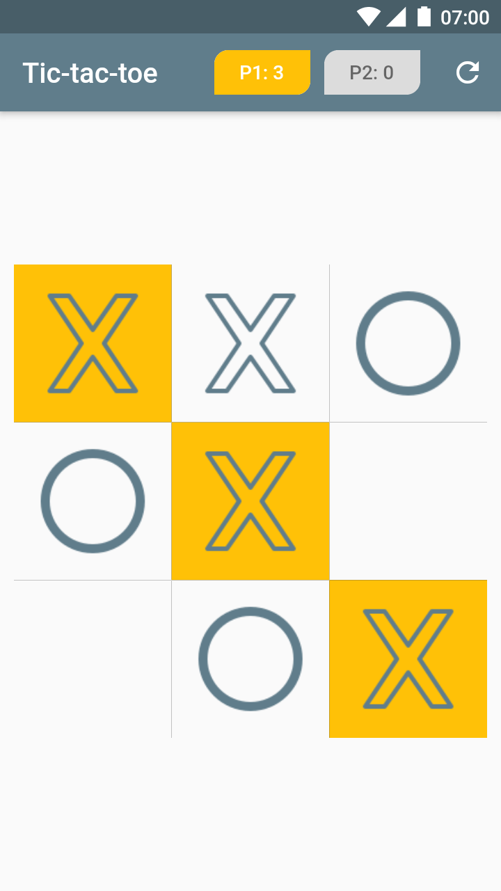
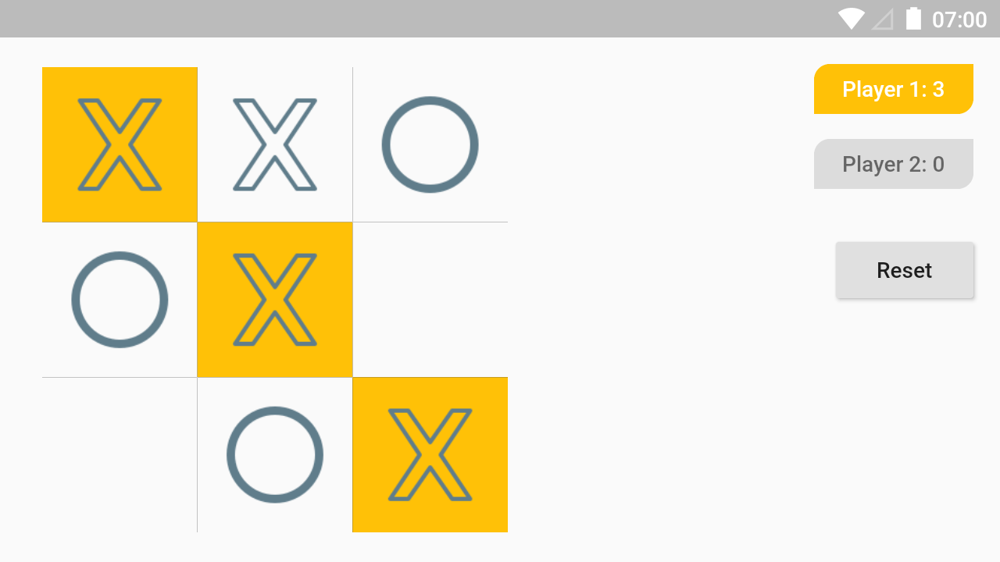

# tic_tac_toe

A Tic Tac Toe Flutter project.
My attempt at building a tic-tac-toe game using flutter and dart.

### Screenshots

   

## Update this space later
[Todo:] Game mode is only multi-player. attempt to make a single player mode
where a player playes with the computer.
